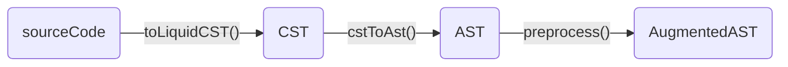
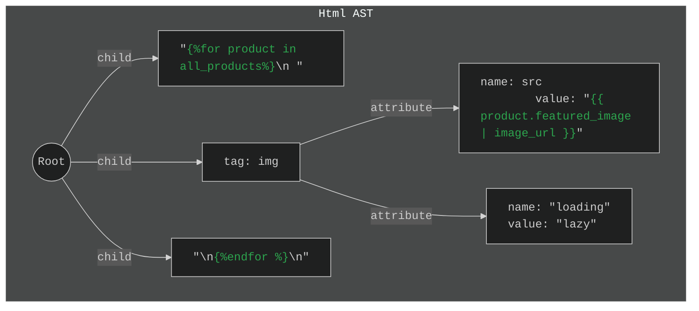
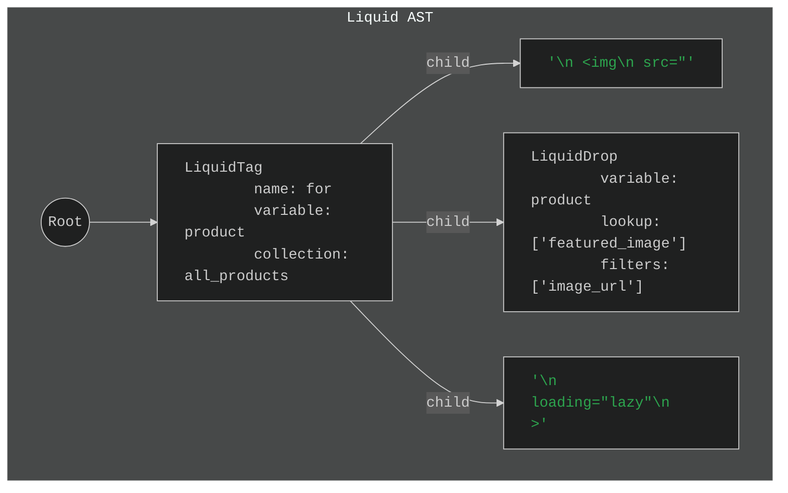
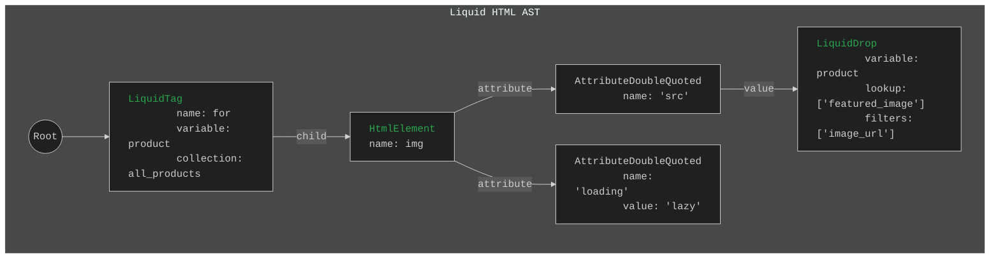

# Parser

In this doc, we'll go over two topics:

- Why we need our own HTML + Liquid parser
- Why and how we got to three stages

## **TL;DR**

Since we need a Liquid _and_ HTML AST to print prettier Liquid+HTML, we need a special parser that handles both. None exist, so we made our own.

Our parser has three stages:

1. [The OhmJS source code to CST transformation](./parser-stage-1-source-code-to-cst.md)
1. [The CST to AST transformation](./parser-stage-2-cst-to-ast.md)
1. [The AST augmentation](./parser-stage-3-ast-to-augmented-ast.md)

The **OhmJS transformation** takes **sourceCode** and turns it into a **Concrete Syntax Tree (CST)**—an intermediary representation of the source code that is _almost_ an AST. Implemented in [`toLiquidCST(source)`](../../src/parser/cst.ts).

The **CST to AST transformation** walks the **CST** and returns an **AST**. Implemented in [`cstToAst(cst)`](../../src/parser/ast.ts).

The **AST augmentation** walks the **AST** and adds new properties on it (e.g. `parentNode`, `firstChild`, `lastChild`, `isIndentationSensitive`, etc.). Implemented in [`preprocess(ast, config)`](../../src/printer/print-preprocess.ts).

In other words, it goes like this:



The rest of this doc explains why and how we got there.

## The big problem

Consider the following statements:

- Prettier is $f(\text{AST}, \text{Config})$
- HTML parsers return an HTML ASTs (with no notion of Liquid)
- Liquid parsers return Liquid ASTs (with no notion of HTML)

If we want a formatter that pretty-prints HTML and Liquid _together_, then we need a parser that merges HTML and Liquid _together_.

That is, if we take the following Liquid+HTML code as example:

```liquid

  

```

The problem is that neither parser understand both languages. They use strings to represent the parts they don't understand:





## The big solution

What we need is an AST that combines both Liquid _and_ HTML. Something like this:



### Getting to a solution

But making a parser is a lot of work... So we took a shortcut by using a parser-generator.

We used [OhmJS](https://ohmjs.org/). Why? I'll admit this:

- Its syntax is pretty
- It has rather good [online editor](https://ohmjs.org/editor/):
  - Lets you iteratively come up with the grammar
  - Lets you visualize the Syntax tree
  - Lets you write explore

More details to follow...

### Problems with OhmJS

The problem with parser generators, however, is that they only spit out Trees for [_context-free grammars_](https://en.wikipedia.org/wiki/Context-free_grammar).

And since HTML and Liquid are _both_ [context-sensitive grammars](https://en.wikipedia.org/wiki/Context-sensitive_grammar), we can't parse both together in one go.

However, we recognized that the _tokens_ contained in HTML and Liquid _are_ context-free.

That is, you could parse `<a class="link"><a>hi</a></a>` as a series of five independent nodes, but not as a tree two child deep.

In other words, you can parse open and close tags independently, but not recognize the parent/child relationship just yet.

So, we're left with a series of context-free nodes:


Since those are rather useful (!), [our first stage](./parser-stage-1-cst-to-ast.md) takes source code and turns it into what we call the **Concrete Syntax Tree[^1].**

### Solution to OhmJS

But—like we said—a CST isn't exactly what we desire. We're almost there but not quite.

This is what [our second stage](./parser-stage-2-cst-to-ast.md) does. It takes the CST we get form Ohm and turn into an AST.

### Oh and one more thing

Some properties are easier to add to the tree once the tree is built. For example: `firstChild`, `lastChild`, `parentNode`, etc.

That's why we have a `preprocess` step that walks the tree and adds those properties to the tree.

It's only a separate step because it makes things easier.

This [third stage](./parser-stage-3-ast-to-augmented-ast.md) takes the AST and turns it into an AugmentedAST.

## Where to go from here

### Breadth first

- [The printer](printer.md)

### Depth first

- [The OhmJS source code to CST transformation](./parser-stage-1-source-code-to-cst.md)
- [The CST to AST transformation](./parser-stage-2-cst-to-ast.md)
- [The AST augmentation](./parser-stage-3-ast-to-augmented-ast.md)
