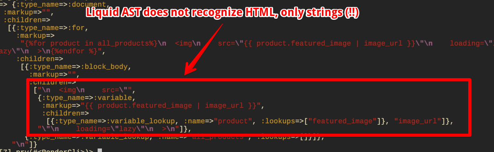

# Parser

In this doc, we'll go over two topics:

- Why we need our own HTML + Liquid parser
- How it works

## **TL;DR**

Since we need a Liquid _and_ HTML AST to print prettier Liquid+HTML, we need a special parser that handles both. None exist, so we made our own.

Our parser has three stages:

| description              | input       | output       | function signature                                             |
| ---                      | ---         | ---          | ---                                                            |
| The OhmJS transformation | source code | CST[^1]      | type toLiquidHtmlCST = (text: string) => CST`                  |
| the AST build            | CST         | AST          | `type cstToAst = (cst: CST) => AST`                            |
| the AST augmentation     | AST         | AugmentedAST | `type preprocess = (ast: AST, config: Config) => AugmentedAST` |

[^1]: Concrete Syntax Tree — An intermediate representation of the tree that is closer to the syntax of the tokens than it is of the language.

In other words, it goes like this:

```
sourceCode -> CST -> AST -> AugmentedAST 
```

The rest of this doc explains why and how we got there.

## The big problem

Consider the following statements:

- Prettier is $f(\text{AST}, \text{Config})$
- HTML parsers return an HTML ASTs (with no notion of Liquid)
- Liquid parsers return Liquid ASTs (with no notion of HTML)

If we want a formatter that pretty-prints HTML and Liquid _together_, then we need a parser that merges HTML and Liquid _together_. 

That is, if we take the following Liquid+HTML code as example:

```liquid

  

```

The HTML tree won't work:


Nor will the Liquid tree:



## The big solution

What we need is an AST that combines both Liquid _and_ HTML. Something like this:


**This is what our parser pipeline does.**

That's why we have our own parser in here.

### Getting to a solution

But... making a parser is a lot of work, so we took a shortcut by using a parser-generator. 

We used [OhmJS](https://ohmjs.org/). Why? I'll admit this:

- Its syntax is pretty
- It has rather good [online editor](https://ohmjs.org/editor/):
  - Lets you iteratively come up with the grammar
  - Lets you visualize the Syntax tree
  - Lets you write explore

### Problems with OhmJS

The problem with parser-generators, however, is that they only spit out _Context-free grammars_. Which is a problem, since HTML and Liquid are _both_ context sensitive.


