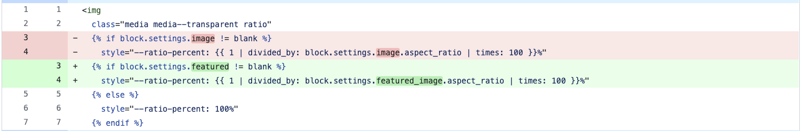
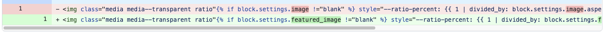

[Principle](./index.md): **Output code that is easy to review**

A Code Formatter greatly benefits pull requests _authors_:

- No manual styling
- Saves back-and-forth on pull requests for style nitpicks
- Saves waiting for CI because of a nitpick

We want more. We want benefits for the _reviewer_ by outputting code that is _easy to review_. Core to the micro-decisions taken for the first draft of the plugin, we always favor code that makes reasonable diffs.

## Example

When refactored, the following two snippets offer drastically different diffs:

### Break attributes
Before change:

```html

```

Diff:



### Inline attributes

Before change:

```html

```

Diff:



We chose the first option because it makes reviewing _easier_.
